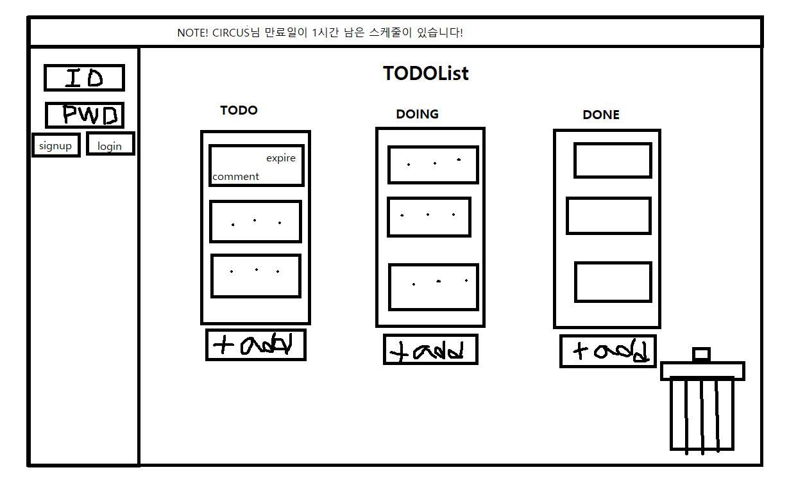

# nodejs-todo-web
Node.js TODO web front project

# TODO List web 버전만들기
- 저번에 만든 이상형월드컵과는 달리 한페이지에서 자바스크립트로 동적으로 변하는 웹페이지를 만들어보자.
1. 우선 화면을 만들고, pr을 보내고 다음에 서버를 만들어서 기능을 추가하여 다시 pr보내자.
2. 화면의 구성은 우선 기본적으로 위쪽에는 TODO List 제목을 표시하고, 화면 전체에 걸쳐 todo, doing, done 컨테이너를 표시하도록 만들자.
3. 컨테이너에서는 스케줄을 추가, 수정, 삭제, 이동이 가능하도록 만들자.
4. 스케줄에는 내용과 만료일을 적을 수 있다.
5. 화면 왼쪽에 바를 만들어서 누르면 로그인 창이 스르륵 나오고, 다시 누르면 들어가도록 만들자.
6. 화면 위쪽에는 알림이 짧게 창으로 나왔다 들어갔다 하도록 만들자.
- 여기까지 하고 1차 pr을 보내자.

- 서버를 만들고, 여러가지 기능을 추가해보자.
1. 로그인을 하면 유저의 닉네임으로 인사말을 추가해보자.
2. 로그인을 하면 DB에 저장되어있던 사용자의 스케줄정보가 화면에 표시되도록 하자.
3. 스케줄을 수정하고 저장버튼을 누르면 수정된 내용이 DB에 저장되도록 하자.
4. 로그아웃할때 수장된 내용을 저장할 것인지 묻도록 하자.