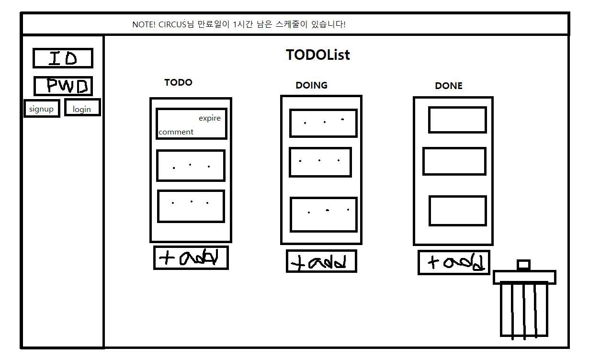

# nodejs-todo-web
Node.js TODO web front project

# TODO List web 버전만들기
- 저번에 만든 이상형월드컵과는 달리 한페이지에서 자바스크립트로 동적으로 변하는 웹페이지를 만들어보자.
1. 우선 화면을 만들고, pr을 보내고 다음에 서버를 만들어서 기능을 추가하여 다시 pr보내자.
2. 화면의 구성은 우선 기본적으로 위쪽에는 TODO List 제목을 표시하고, 화면 전체에 걸쳐 todo, doing, done 컨테이너를 표시하도록 만들자.
3. 컨테이너에서는 스케줄을 추가, 수정, 삭제, 이동이 가능하도록 만들자.
4. 스케줄에는 내용과 만료일을 적을 수 있다.
5. 화면 왼쪽에 바를 만들어서 누르면 로그인 창이 스르륵 나오고, 다시 누르면 들어가도록 만들자.
6. 화면 위쪽에는 알림이 짧게 창으로 나왔다 들어갔다 하도록 만들자.
- 여기까지 하고 1차 pr을 보내자.

- 서버를 만들고, 여러가지 기능을 추가해보자.
1. 로그인을 하면 유저의 닉네임으로 인사말을 추가해보자.
2. 로그인을 하면 DB에 저장되어있던 사용자의 스케줄정보가 화면에 표시되도록 하자.
3. 스케줄을 수정하고 저장버튼을 누르면 수정된 내용이 DB에 저장되도록 하자.
4. 로그아웃할때 수장된 내용을 저장할 것인지 묻도록 하자.

# TODO List web 완성
- node.js만을 가지고 TODO List만들기 (DB없이, express없이)

## 기능
1. 회원가입
2. 로그인, 로그아웃
3. 스케줄작성, 이동, 수정, 삭제

## 상세기능

### 회원가입
- 마우스를 화면왼쪽 구석의 작은 영역에 올리면 로그인창이 나옵니다.
- 그 후 SIGNUP버튼을 누르면 회원가입창이 나옵니다.
1. 아이디 중복체크:
    1. 아이디는 공백이 없어야합니다.
    2. 영어 소문자와 숫자의 조합이어야 합니다.
    3. 4글자 이상 12글자 이하여야 합니다.
    4. DB에 등록된 아이디는 사용할 수 없습니다.

2. 비밀번호 체크:
    1. 비밀번호는 최소 8자리 이상이어야 합니다.
    2. 비밀번호를 한번 더 입력하여 같아야 합니다.

3. 계정을 생성: 아이디 중복체크를 해야만 합니다.(중복체크 후 수정하면 초기화됩니다.)

### 로그인
1. 등록된 계정이어야만 로그인 할 수 있습니다.
2. 계정에 맞는 비밀번호를 입력해야만 로그인 할 수 있습니다.
3. 로그인을 하면 DB에 저장된 스케줄데이터를 가져와 화면에 출력해 줍니다.
4. 로그인한 상태에서 스케줄을 작성하거나 변경하면 해당 유저의 DB에 적용됩니다.

### 로그아웃
1. LOGOUT버튼을 누르면 더 이상 유저의 스케줄정보를 출력하지 않습니다.
2. 다시 로그인창을 출력해줍니다.

### 스케줄
1. 로그인 하지 않지 않으면 DB에 저장되지 않습니다. 새로고침하면 사라집니다.

2. 스케줄 작성:
    1. 초록색 더하기 모양의 단추를 클릭하면 스케줄을 작성할 수 있는 입력창이 나옵니다.
    2. 텍스트를 입력하고 enter를 누르면 스케줄이 입력됩니다.

3. 스케줄 수정:
    1. 스케줄을 클릭하면 변경할 수 있는 입력창이 나옵니다.
    2. 스케줄 변경후 enter를 누르면 변경사항이 적용됩니다.

4. 스케줄 이동:
    1. 스케줄을 드래그해서 todo, doing, done 원하는 위치에 drop하면 해당 위치로 이동합니다.

5. 스케줄 삭제:
    1. 스케줄을 drag해 쓰레기통에 drop하면 삭제됩니다.

## URL 요청

| login   | url    | method          | body                | Function              |
| ------- | ------ | --------------- | ------------------- | --------------------- |
| X       | GET    | /               |                     | Home                  |
| X       | POST   | /identification | id                  | ID duplication check  |
| X       | POST   | /createID       | id, pwd             | Create Account        |
| X       | POST   | /login          | id, pwd             | Login                 |
| O       | POST   | /createSchedule | status, text        | Create Schedule       |
| O       | POST   | /changeSchedule | object              | Change Schedule       |
| O       | POST   | /updateSchedule | status, text, index | Update Schedule       |
| O       | GET    | /logOut         | X                   | Logout                |
| ?       | GET    | error404        | X                   | error 404             |
| ?       | GET    | error500        | X                   | error 500             |

## 모듈
1. bin.js
    1. app.js롤 임포트하여 응답을 대기한다.

2. app.js
    1. Application.js, serve-static.js, index.js, logger.js, body-parser.js, model.js, errors.js, util.js를 임포트하여 실행시켜준다.
    2. 요청 응답에 맞는 모듈과 함수들을 라우팅해준다.
    3. 그 후 app을 exports한다.

3. src
    1. Application.js
        1. http, Middleware.js를 임포트한다.
        2. http모듈로 서버를 생성한다.
        3. 들어온 경로와 함수를 용청별로 분류하여 middleware에 실행시킨다.
    2. Middleware.js
        1. middlewares 배열을 선언하고, 함수들을 쌓는다.
        2. 미들웨어가 실행되면 배열안의 함수들을 차례대로 꺼내 실행한다.
        3. 다음 실행될 함수를 next안에 넣어 인자로 넘긴다.
        4. 요청메소드와 함수안의 메소드와 일치하는 것을 실행시킨다.

4. middlewares
    1. logger.js
        1. request의 메소드와 url을 콘솔에 출력한다.
        2. 이때 메소드는 색깔을 입혀서 출력한다.
    2. body-parser.js
        1. 버퍼로 들어오는 body를 파싱해 객체로 만들어 request.body에 넣는다.
    3. serve-static.js
        1. path, fs, template.js를 임포트한다.
        2. mimtype을 이용해 요청에 맞춰 헤더를 설정해서 응답한다.
        3. 단 javascript는 로그인상태와 로그아웃상태를 구분하기위해 template.js에서 문자열로 리턴한값을 받아온다.
    4. errors.js
        1. 404, 500 error발생시 statusCode를 설정하여 출력한다.

5. routes
    1. index.js
        1. '/'url 요청시 web.html을 출력한다.

6. model
    1. model.js
        1. fs 모듈을 임포트한다.
        2. 아이디 중복체크 요청시 db를 탐색하여 확인한다.
        3. 회원가입요청시 DB에 계정을 새롭게 생성한다.
        4. 로그인 요청시 req.body에서 id, pwd를 받아와 DB와 비교해보고 맞으면 session을 서버메모리에 저장하고 Set-Cookie에도 적어준다.
        5. 로그인 상태에서 스케줄 생성시 DB에 반영한다.
        6. 로그인 상태에서 스케줄 변경시(이동,삭제) DB에 반영한다.
        7. 스케줄 수정 시 DB에 반영한다.
        8. 로그아웃 요청시 session을 서버와 클라이언트에서 삭제한다.

7. util
    1. util.js
        1. 로그인 할 때 세션을 생성하여 메모리에 저장하고, session번호와 마감시간을 리턴한다.
        2. 쿠키값을 파싱하여 객체로 반환한다.

8. public
    1. css/style.css : web.html의 css
    2. img/이미즈들...png : web.html에서 사용하는 이미지들
    3. js/template.js
        1. web.html에서 사용할 javascript를 반환한다.
        2. userID와 userTodo를 인자로 받아 로그인이 된 상태일 경우 web.html에 뿌려준다.
        3. 각종 event들을 실행시켜 준다.
    4. web.html : 브라우저에 출력할 정보의 뼈대

9. db
    1. users.json : 유저의 아이디와 비밀번호를 저장
    2. todos.json : 유저별 스케줄 정보를 저장

# 마무리
- 김정환 블로그의 express만들기를 보면서 많이 참고하였다.
- 이 app을 만들면서 express의 동작방식에 대한 이해가 많이 늘었다.
- 프론트를 만들면서 html과 css, javascript가 상호작용하는 기본적인 방법을 이해할 수 있었다.
- DB를 사용안하니 읽고 덮어쓰고의 반복으로 구현할 수 밖에 없었다. 그래서 DB의 필요성을 절감할 수 있었다.
- client와 server간의 정보를 주고받는 기본적인 방법을 이해할 수 있었다.
